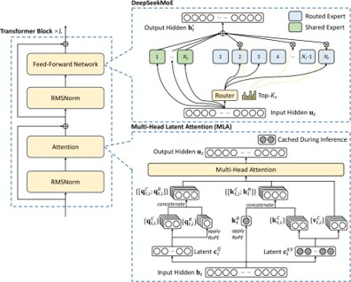
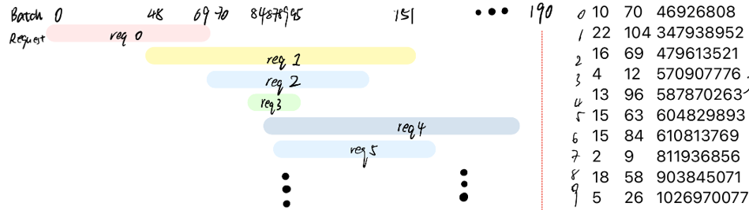
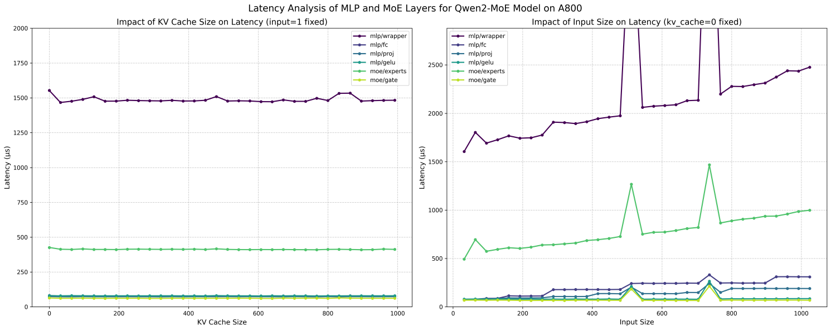
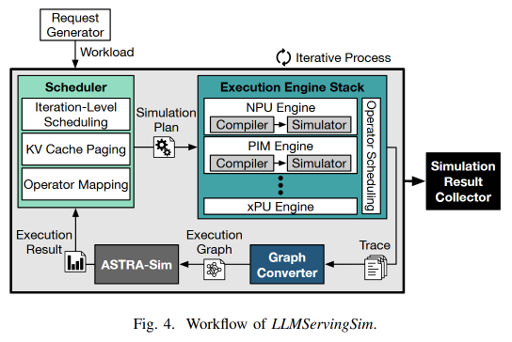
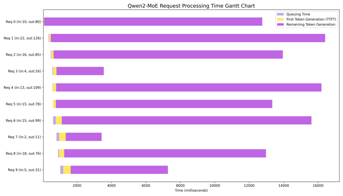

# MoEServingSim: MoE Serving Simulation

**Members:** Ye Wang, Danyang Chen

## Abstract

This project supports Mixture-of-Experts (MoE) architecture LLM. By incorporating new trace construction, memory modeling, and communication logic, we extended LLMServingSim to simulate modern sparse models like Qwen2-MoE. Experiments show insights into how bandwidth, memory, and scheduling affect performance.

## 1. Introduction

### 1.1 Background

Large Language Model (LLM) inference is central to modern AI applications but comes with high computation and memory demands. Traditional LLM simulators focus on dense models, which are no longer optimal for resource-constrained environments. Mixture-of-Experts (MoE) models offer a sparse alternative that activates only a subset of experts per token, balancing performance and cost.

### 1.2 Project Objective

This project aims to enhance the LLMServingSim simulator to support MoE architecture, addressing the following objectives:

* Enable trace generation and scheduling for MoE models.
* Incorporate memory modeling for expert routing and MoE-specific sublayers.
* Ensure correctness in communication, especially allreduce synchronization.
* Profile MoE workloads on real hardware (e.g., A800) using CUDA instrumentation.

## 2. Motivation

The 2024 IISWC Best Paper Award-winning LLMServingSim [1] provides a useful simulation but is outdated for sparse models. Our work modernizes the simulator to reflect realistic workloads from models like Qwen2-MoE.


MoE models introduce sparse activation over large parameter spaces:

* Architecture: Standard FFNs are replaced with expert layers.
* Parameter sparsity: Only a few experts are active per token.
* Performance: MoE models outperform dense models on compute and memory efficiency.

## 3. Work

### 3.1 Input

* **Input I**: Request Arrival Traces

  * Use public datasets such as Alpaca and ShareGPT to simulate real-world request patterns.
* **Input II**: MoE Profiling on A800

  * Use NVTX + CUDA.event to measure sublayer execution time and generate fine-grained traces.

### 3.2 Workflow

* **Scheduler**: Groups requests into execution batches.
* **Execution Engine**: Compiles the model for target batch configuration and schedules kernel execution from multiple request traces.
* **ASTRA-sim**: Receives execution graphs (Chakra format), performs detailed system-level simulation, and feeds results back to the scheduler.

### 3.3 Implementation

A critical aspect of extending `LLMServingSim` for MoE models involved ensuring the accuracy and completeness of the underlying performance profiles and correctly configuring the simulation for new model structures.

*   **Configuration & Performance Data Integrity**:
    *   The simulator heavily relies on CSV-based performance profiles (e.g., `perf_model/A800.csv`) that provide latency data for various model layers under different conditions (input length, KV cache size, etc.).

*   **Trace & Model Expansion for MoE**:
    *   Building upon a stable data foundation, we introduced MoE-specific trace annotations. This includes differentiating standard layers from MoE-specific sublayers such as `moe/gate` (for routing decisions) and `moe/experts` (for the expert computations).
    *   The memory model was extended to account for the unique structures in MoE, such as the memory footprint of multiple experts and the data structures needed for expert routing and token dispatch. This ensures that memory constraints and bandwidth are realistically simulated for sparse architectures.

*   **Communication**:
    *   For MoE models, especially when experts are distributed across multiple NPUs (via `npu_group`), ensuring correct and efficient communication primitives is vital.
    *   We focused on verifying the AllReduce synchronization logic, which is often a bottleneck in parallel expert computations. Accurate trace data for communication steps, derived from profiling or careful modeling, is necessary here as well.

## 4. Results

### 4.1 Experiment Setup

* **Hardware**: A800
* **Memory**: 40 GB
* **GPU Count**: 1
* **Local Bandwidth**: 1024
* **Remote Bandwidth**: 512

## 5. Discussion

* The simulator previously assumed dense execution; sparse MoE routing requires new batching logic.
* Fine-tuning communication primitives like allreduce is critical to MoE performance.
* Profiling on A800 reveals that expert activation varies dramatically across sequences.

## 6. Conclusion and Future Work

### 6.1 Key Takeaways

* We successfully adapted LLMServingSim to support MoE-based LLMs.
* Profiling-based trace generation enables realistic simulation of sublayer execution.
* Communication and scheduling are significant performance levers for MoE inference.

### 6.2 Future Work

* Implement finer-grained scheduling (e.g., continuous batching).
* Extend support to more MoE models such as DeepSeek-R1.
* Integrate more GPU types and real-device validation for trace fidelity.

## 7. References
[1] Cho, J., Kim, M., Choi, H., Heo, G., & Park, J. (2024). LLMServingSim: A HW/SW Co-Simulation Infrastructure for LLM Inference Serving at Scale. In *2024 IEEE International Symposium on Workload Characterization (IISWC)* (pp. 15-29). IEEE. https://doi.org/10.1109/IISWC63097.2024.00012

## 8. Appendix

### A.1 Example `run_moe.sh` Configuration

```bash
#!/bin/bash
python main.py --model_name 'qwen2-moe' --hardware 'A800' --npu_num 1 --npu_group 1 --npu_mem 40 \
    --local_bw 1024 --remote_bw 512 --link_bw 256 --fp 16 --block_size 8 \
    --dataset 'dataset/share-gpt-req100-rate10.tsv' --output "output/example_run.csv" \
    --verbose --req_num 50
```
